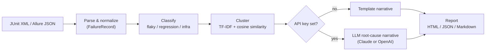

# AI-Powered Test Failure Triage

[](https://github.com/Bhargav2093/ai-powered-test-failure-triage/actions/workflows/ci.yml)

> Part of the [Quality Engineering Reference Architecture](https://github.com/Bhargav2093/quality-engineering-reference-architecture) — implements the [AI Quality Intelligence](https://github.com/Bhargav2093/quality-engineering-reference-architecture/blob/develop/docs/ai-quality-intelligence.md) pillar.

Ingests failing test output from JUnit-style XML (Maven Surefire, TestNG, pytest `--junitxml`)
and Allure `*-result.json` files, then automatically:

- **Classifies** each failure as `flaky`, `regression`, or `infra` using a deterministic,
  rule-based core (no API key, no network call, always available)
- **Clusters** failures that likely share one root cause using TF-IDF + cosine similarity, so
  a single break spanning many tests shows up as one triage item instead of dozens
- **Narrates** each cluster with a short root-cause summary — a template by default, or a real
  LLM-generated narrative when `ANTHROPIC_API_KEY` or `OPENAI_API_KEY` is set (pluggable
  provider, see below — no single-vendor lock-in)
- **Reports** the result as a self-contained HTML page, JSON, or Markdown (ready to paste into a
  PR comment)

Built to be plug-and-play with the [Enterprise Hybrid Automation Framework](https://github.com/Bhargav2093/enterprise-hybrid-automation-framework)'s
own Surefire/Allure output, but works with any tool that emits the same JUnit XML schema —
that includes TestNG, pytest, and most CI runners.

## Sample output


No need to run anything to see what this looks like: [`samples/sample-triage-report.md`](samples/sample-triage-report.md)
and [`samples/sample-triage-report.html`](samples/sample-triage-report.html) are committed,
generated from one **real captured failure** (`tests/fixtures/real_framework_failure/`, from the
Enterprise Hybrid Automation Framework) plus a hand-written synthetic fixture covering the other
two categories — 5 raw failures triaged into 3 clusters spanning all three categories
(flaky/regression/infra), using the template narrator (no API key needed to reproduce it):

```bash
triage --junit-xml tests/fixtures/real_framework_failure/junit-report.xml \
  tests/fixtures/synthetic/mixed_failures.xml --format markdown
```

The GIF above is the real output of that exact command, rendered deterministically by
[`scripts/generate_demo_gif.py`](scripts/generate_demo_gif.py) rather than screen-captured — no
`node-pty`/display dependency, and the transcript it draws is copied verbatim from the committed
sample report. Regenerate it with `pip install -e ".[demo]" && python scripts/generate_demo_gif.py`.

## Why deterministic-core-plus-optional-LLM

The classification and clustering pipeline is 100% rule-based and offline — it never calls an
API and never requires a key. The LLM layer only adds a nicer, human-readable narrative on top
of a result that's already fully computed. If no LLM API key is set, `narrate_cluster()` returns
a clear template-based summary instead — same return type, same call site, zero cost. If the API
call fails for any reason (rate limit, network, bad key), it degrades to the same template rather
than crashing the whole triage run.

## Pluggable LLM provider

The narrator isn't tied to one vendor. Set whichever key you already have:

| Env var | Effect |
|---|---|
| `ANTHROPIC_API_KEY` | Uses Claude (`claude-opus-5` by default, override with `CLAUDE_MODEL`) |
| `OPENAI_API_KEY` | Uses an OpenAI chat model (`gpt-4o-mini` by default, override with `OPENAI_MODEL`) |
| `LLM_PROVIDER=anthropic\|openai` | Forces the provider explicitly, overriding key-precedence |
| *(neither key set)* | Deterministic template — zero cost, zero network calls |

If both keys happen to be set, Anthropic is used unless `LLM_PROVIDER` says otherwise. Either
path produces the same narrative shape and degrades to the template on any API error, so
switching providers is a one-env-var change, not a code change (`src/triage/llm.py`).

## Install

Requires Python 3.11+.

```bash
python -m venv .venv
.venv/Scripts/activate          # .venv/bin/activate on macOS/Linux
pip install -e ".[dev]"
```

## Usage

```bash
# Point it at JUnit-style XML (Surefire, TestNG, pytest --junitxml)
triage --junit-xml target/surefire-reports/junitreports/*.xml

# Or at a directory of Allure *-result.json files
triage --allure-dir target/allure-results

# Both at once, and pick a format
triage --junit-xml report1.xml report2.xml --allure-dir allure-results --format markdown

# Real root-cause narratives instead of templates - either provider works
export ANTHROPIC_API_KEY=sk-ant-...     # or: export OPENAI_API_KEY=sk-...
triage --junit-xml report.xml --format html --output triage-report.html
```

Formats: `html` (default, self-contained single file), `json` (machine-readable, e.g. for a CI
gate), `markdown` (PR-comment ready). See [Pluggable LLM provider](#pluggable-llm-provider) for
the full set of narrator env vars.

## Architecture



```
src/triage/
├── models.py           # FailureRecord, Classification, Cluster, TriageResult
├── parsers/
│   ├── junit_xml.py    # JUnit/Surefire-style testsuite/testcase XML
│   └── allure_json.py  # Allure *-result.json
├── classify.py          # rule-based: flaky / regression / infra, with confidence
├── cluster.py            # TF-IDF + cosine-similarity grouping within a category
├── llm.py                 # Pluggable Claude/OpenAI root-cause narrator, graceful no-key fallback
├── report.py               # HTML / JSON / Markdown rendering
└── cli.py                   # `triage` entrypoint
```

**Classification** parses the exception type and message out of each failure's stack trace.
`StaleElementReferenceException`, `ElementClickInterceptedException`, and Selenium
`TimeoutException` signal `flaky`. `ConnectException`, `SocketTimeoutException`,
`UnknownHostException`, and connection-refused text signal `infra`. Everything else defaults to
`regression` — a real assertion failure is never silently relabeled as flaky.

**Clustering** never merges failures across categories, even if their text is similar. Within a
category, each failure is reduced to a normalized signature (exception type + top stack frame +
message with numbers/paths stripped), vectorized with `TfidfVectorizer`, and grouped by
cosine-similarity threshold (default `0.6`, tune with `--similarity-threshold`).

## Metrics / impact

Run against a **synthetic 500-failure benchmark** (`samples/benchmark/`, generated by
[`scripts/generate_benchmark_fixture.py`](scripts/generate_benchmark_fixture.py) — 18 distinct
root causes manifesting across 500 individual test cases with randomized noise, so no two
failures are byte-identical):

| Metric | Value |
|---|---|
| Raw failing tests | 500 |
| Triage items after clustering | 41 |
| Reduction | **91.8%** fewer items to review |
| Category breakdown | 226 flaky · 191 regression · 83 infra |

Instead of scanning 500 individual stack traces, a human reviews 41 clustered root-cause
narratives — of which 18 correspond to the primary designed root causes (11–51 tests each) and
the remaining 23 are smaller fragments where per-instance noise pushed a few outliers below the
`0.6` similarity threshold, a real and expected tradeoff of TF-IDF clustering that
`--similarity-threshold` lets you tune. If manual triage takes roughly the same few minutes per
item whether it's reviewed alone or as part of a cluster — a conservative assumption, since a
clustered item is usually faster to dismiss — cutting 500 review decisions to 41 cuts total
manual triage time by roughly the same ~92%.

This is a synthetic benchmark, not a customer metric — reproduce it yourself:

```bash
python scripts/generate_benchmark_fixture.py
triage --junit-xml samples/benchmark/synthetic_500_failures.xml --format json
```

## Testing

```bash
pytest -v
```

42 tests cover both parsers against a **real captured failure** from the Enterprise Hybrid
Automation Framework repo (`tests/fixtures/real_framework_failure/`) plus hand-written synthetic
fixtures covering flaky/infra/regression variety
(`tests/fixtures/synthetic/mixed_failures.xml`), the classifier's signal matching, clustering's
category/similarity rules, the LLM narrator's no-key template path and mocked-client real path
for **both** providers (Claude and OpenAI) plus provider-selection precedence (no API key needed
to run the suite), and all three report formats end-to-end via the CLI.

The real fixture was captured by temporarily breaking an assertion in the framework repo,
running `mvn test`, and copying the genuine `TEST-*.xml`/`*-result.json` output — the framework
repo itself was left untouched afterward.

## CI

GitHub Actions runs the full pytest suite plus a CLI smoke test against the bundled fixtures on
every push/PR — no `ANTHROPIC_API_KEY` required, matching how the tool is designed to run
anywhere out of the box.
